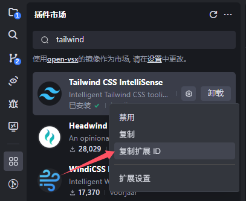
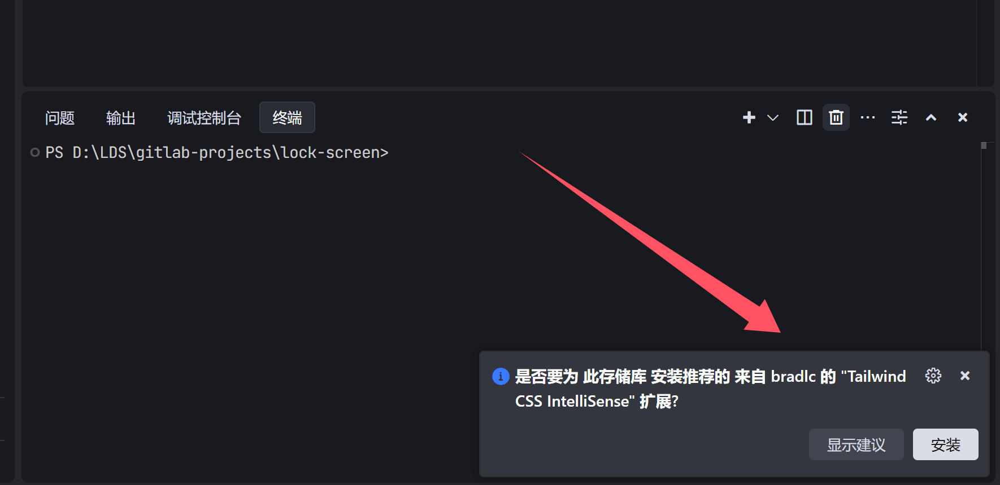

## 前言
在我们开发时可以使用一些提升开发体验的插件，但得手动装。当多人开发同一项目时，环境一致能提高效率。

下面以 `Tailwind CSS IntelliSense` 插件为例，介绍如何配置插件安装提示。

<!-- truncate -->
## 实现
**- *01* -**


在插件市场中复制 插件ID




**- *02* -**

填写至 `extensions.json` 中
```json
// .vscode/extensions.json

{
    "recommendations": [
        "bradlc.vscode-tailwindcss"
    ]
}
```

**-03-**

未安装此插件的开发者，打开项目时会收到提示。



