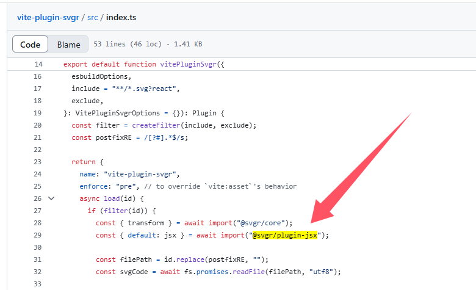
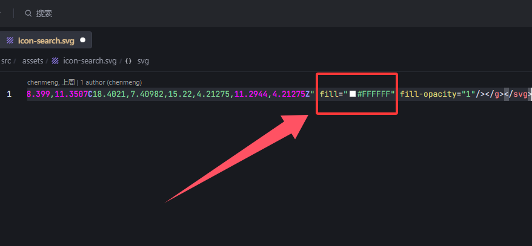

## 背景
在网页开发中，遇到结构比较简单的小图标，我们一般会采用 SVG 格式来显示。这是因为 SVG 是一种矢量图，具有放大不失真、文件体积小的特点。

<!-- truncate -->

SVG 在前端开发中通常有这几种使用方式
1. 内嵌到 HTML 中
2. CSS 背景图
3. 使用 img 标签引入

这里的 SVGR 是用来将 SVG 文件转换为 React 组件的工具。

## 安装依赖
vite-plugin-svgr 中存在 @svgr/plugin-jsx 的依赖，所以这里不用安装



```bash
pnpm install vite-plugin-svgr @svgr/plugin-svgo -D
```
## 配置
```js
// vite.config.js

import svgr from 'vite-plugin-svgr'

export default defineConfig({
    plugins: [svgr({
        svgrOptions: {
            plugins: ["@svgr/plugin-svgo", "@svgr/plugin-jsx"],
            svgoConfig: {
                floatPrecision: 2,
            },
        },
        // ...
    })],
})
```

- @svgr/plugin-svgo：使用 SVGO（SVG Optimizer）优化 SVG 文件，去除不必要的代码，减小文件体积。
- @svgr/plugin-jsx：将优化后的 SVG 转换为 React JSX 组件。
- svgoConfig-floatPrecision-2：设置 SVG 中浮点数的精度为 2 位小数，以此减少文件大小。

## 使用
```tsx
import IconSearch from "@/assets/icon-search.svg?react";

function DemoComp(){
    return (
        <div>
            <IconSearch />
        </div>
    )
}
```

将原始文件中的 fill 属性删除



```tsx
function DemoComp(){
    return (
        <div>
            <IconSearch className="hover:fill-black fill-red-800" />
        </div>
    )
}
```

## 参考
- [SVG 从入门到后悔，怎么不早点学起来（图解版）](https://mp.weixin.qq.com/s/EDbRujFqpIXy4VyP1XH2lw)
- [tailwindcss svg fill](https://tailwindcss.com/docs/fill)
- [vite-plugin-svgr](https://github.com/pd4d10/vite-plugin-svgr)