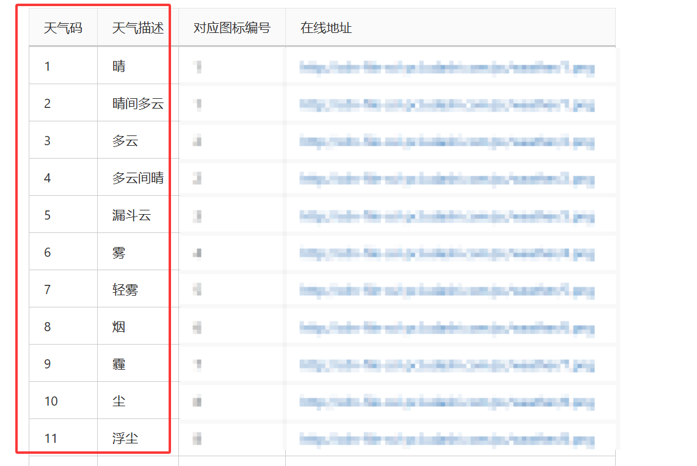
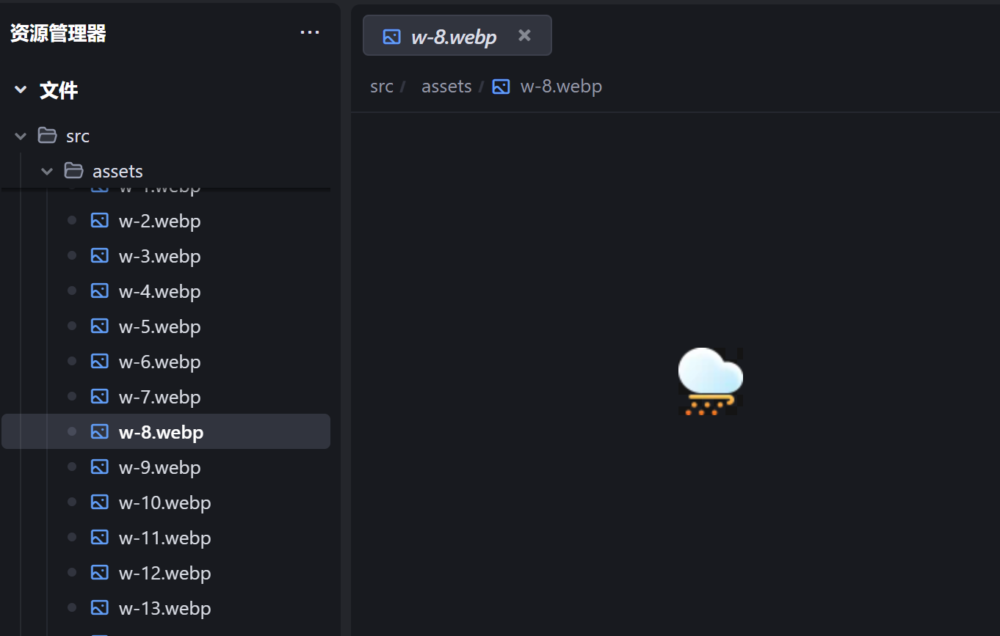

## 前言
最近开发一款屏保项目时遇到了一个问题：一个用于展示天气的组件拥有几十种需要展示的天气图标。

按照常规处理，一般是直接引入图片，然后根据后端返回的状态，来展示不同的图片，像下面这样：

```tsx
import weatherIcon1 from './assets/weather-icon-1.webp';
import weatherIcon2 from './assets/weather-icon-2.webp';
import weatherIcon3 from './assets/weather-icon-3.webp';
// ... 其他天气图标

const WeatherIcon = ({ weatherState }) => {
  const iconMap = {
    'clear-sky': weatherIcon1,
    'few-clouds': weatherIcon2,
    'scattered-clouds': weatherIcon3,
    // ... 其他映射关系
  };

  const icon = iconMap[weatherState];
  if (!icon) {
    throw new Error(`Unknown weather state: ${weatherState}`);
  }

  return ;
};
```
但显然不能这样编写代码，因为图标数量过多，手动维护映射关系过于繁琐。于是，我想起了之前了解过的静态资源动态加载方法。

## 动态加载静态资源

**- *01* -** 

根据约定的映射规则来重命名静态资源。




**- *02* -** 

在 Vite 项目中，可以使用 `import.meta.url` 获取当前模块的 URL，然后结合 `new URL()` 来动态构建资源的路径。

```tsx
import React from 'react';

const WeatherIcon = ({ weatherState }) => {
  const iconUrl = new URL(`../assets/${weatherState}.webp`, import.meta.url);

  return ;
};
```


```js
// 工作原理

const WeatherIcon = ({ weatherState }) => {
  const iconUrl = new URL(`../assets/${weatherState}.webp`, import.meta.url);

  return ;
};


```

:::tip
依赖分析：编译时态，代码并没有运行，只能去分析抽象语法树，所以无法识别动态的链接

Vite 自动依赖发现：
1. 多媒体元素的 ***静态*** 链接
2. 样式中的静态链接
3. 动态导入语句中的静态或半静态链接
4. URL构造器中的静态或半静态链接
:::

## 参考
- [深入解析 import.meta.url：与 new URL() 的关系及 Vite 中的 base 路径影响](https://juejin.cn/post/7512671108396548146)
- [new URL(url, import.meta.url)](https://cn.vite.dev/guide/assets.html#new-url-url-import-meta-url)