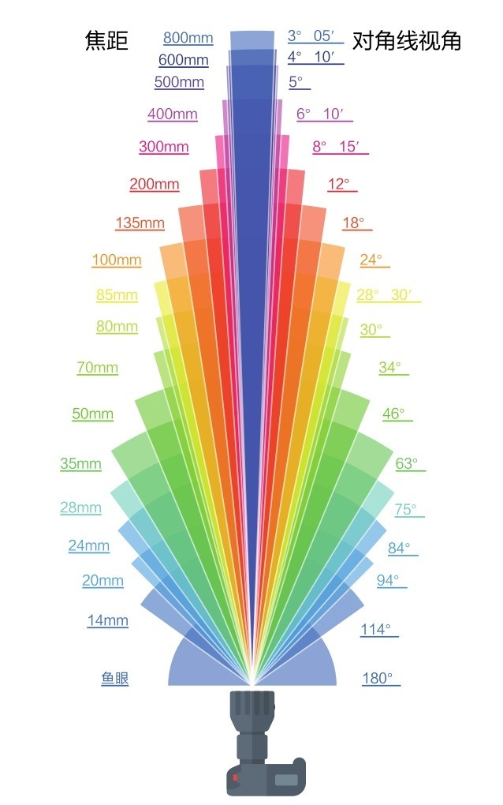

### 焦距
焦距是指镜头的光学中心点到成像平面的距离。
- 焦距越长，拍摄的视野就越窄，取景范围就越窄，画面中容纳的景物就越少，但是每个景物在画面中占的面积就越大
- 焦距越短，拍摄的视野就越宽，取景范围就越广，画面中容纳的景物就越多，但是每个景物在画面中占的面积就越小

### 镜头按焦段分类
镜头按焦段划分，可分为：
1. 广角镜头
2. 标准镜头
3. 长焦镜头

### 焦距对透视关系的影响
镜头的焦距不仅会影响视角，还会影响画面中的透视关系（空间感、透视感）：
- **长焦镜头**：拍摄距离远，会产生透视压缩，使主题与背景之间的距离看起来非常近。
- **广角镜头**：需要离主体很近拍摄，这样会加强透视感，使主题与背景之间的距离看起来比实际的要远。

### 镜头选择
具体的镜头怎么选择，取决于摄影师的想法与构思。

### 参考
- [【硬核科普】焦段是什么？](https://www.bilibili.com/video/BV1nK41157no)
