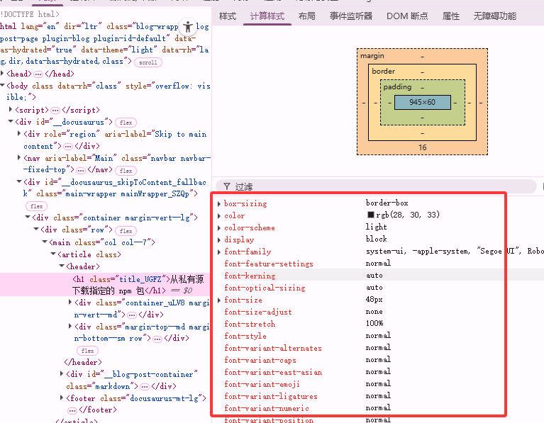

CSS 属性值的计算过程指的是: 某个元素「所有 CSS 属性」从没有值，到有值的过程。该过程就是研究计算样式结果的计算过程。

<!-- truncate -->

每一个 CSS 元素，都必须保证全部的 CSS 属性有值，计算结果真正决定了页面中的元素所呈现的效果。

整个过程分为四个步骤：
1. 确定声明值
2. 层叠
3. 继承
4. 使用默认值

## 确定声明值
参考样式表中没有冲突的声明，作为CSS属性值

:::tip
​​参考样式表（Reference Style Sheet）​​ 指的是​​所有能够影响当前元素的、来自不同来源的 CSS 样式规则的集合​​。
:::

## 层叠
对样式表中有冲突的声明使用层叠规则，确定CSS属性值

### 1. 比较重要性
重要性从高到低排序如下：
1. 带有 `important` 的默认样式
2. 带有 `important` 的作者样式
3. 作者样式
4. 默认样式

### 2. 比较特殊性
| style                | id              | 属性                     | 元素               |
| -------------------- | --------------- | ------------------------ | ------------------ |
| 内联样式：1，否则：0 | id 选择器的数量 | 属性、类、伪类选择器数量 | 元素、伪元素的数量 |

比较这四个数字的大小，谁大就采用谁。先比较高位，高位相同则比较低位，依次比较。

### 3. 比较源次序
代码靠后的覆盖靠前的。

## 继承
对于仍然没有值的属性，若可以继承，则使用继承。一般只有文字相关的属性可以继承。

## 使用默认值
对仍然没有值的属性，直接使用默认值。
